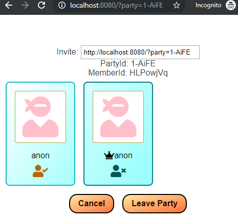

# vuex-party-example

An example of a party service with a vuex+vuejs front end. Uses [https://github.com/timetocode/party], which contains the documentation for the api.

The 'ready' and 'cancel' features are just aesthetic -- the party leader may choose to start at any time.



## Project setup
```
npm install && npm start
```

### Compiles and minifies for production (just the VueJS part)
```
npm run build
```

### Server
The server side is located in /service/app.js